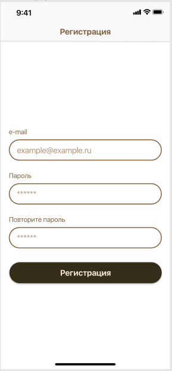
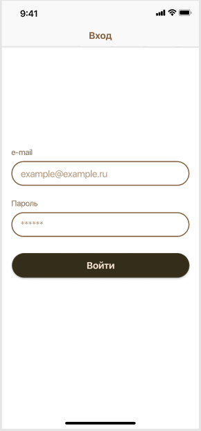
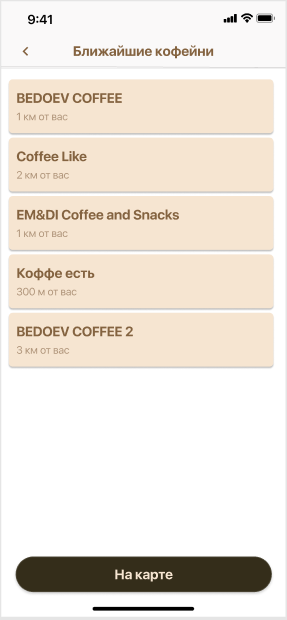
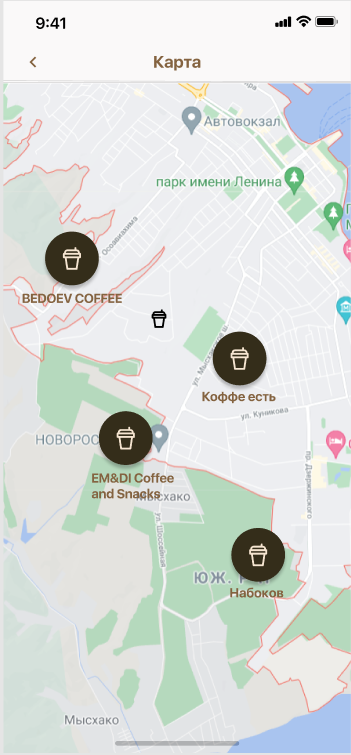
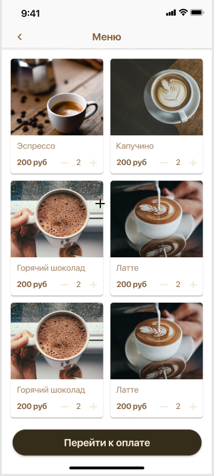
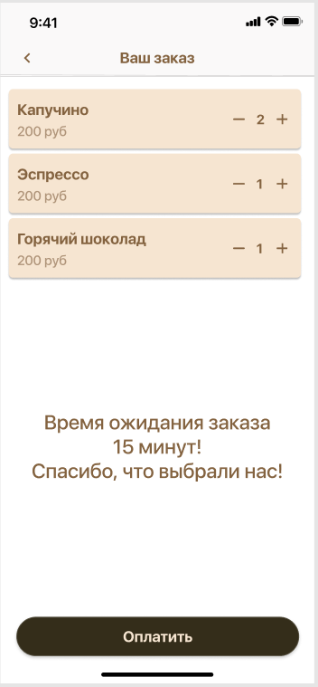
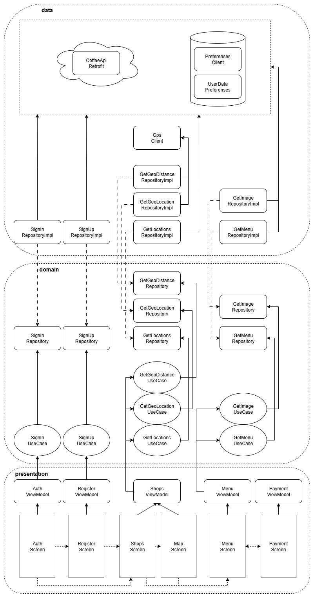

## Тестовое задание "Кофейни"

Техническое задание

## Задача:

* сверстать экраны мобильного приложения (6 шт.);
* подключить API;
* залить в github;
* расшарить доступ проверяющему.

Строгих требований к текстовым полям нет.

Ожидаемая архитектура: MVVM.

Для вёрстки: Jetpack Compose.

Для сетевых запросов: OkHttp/Retrofit2 и Coroutines.

Для навигации: Android navigation component или Cicerone.

## Экран 1: Регистрация

API: /auth/register

## Экран 2: Вход

API: /auth/login

## Экран 3: Ближайшие кофейни

API: /locations

*Дополнительное задание: отобразить расстояние от пользователя, используя геолокацию.

## Экран 4: Ближайшие кофейни

*Дополнительное задание: подключить Яндекс Карты и отобразить на них кофейни. Данные те же, что и на Экране 3

## Экран 5: Меню

Отобразить данные меню

API: /location/{id}/menu

## Экран 6: Ваш заказ

Отобразить пункты, выбранные на предыдущем экране

# API

## /auth/login

<table>
  <tr>
    <td>POST</td>
    <td>/auth/login</td>
  </tr>
  <tr>
    <td colspan="2">Авторизоваться</td>
  </tr>
  <tr>
    <td colspan="2">Request body</td>
  </tr>
  <tr>
    <td colspan="2">
{

&emsp;"login": "string",

&emsp;"password": "string"

}
</td>
  </tr>
  <tr>
    <td colspan="2">Response</td>
  </tr>

  <tr>
    <td>Code</td>
    <td>Description</td>
  </tr>

  <tr>
    <td>200</td>
    <td>Всё в порядке

{

&emsp;"token": "string",

&emsp;"tokenLifeTime": number

}
</td>
  </tr>

  <tr>
    <td>400</td>
    <td>Ошибка в запросе

login: NotNull, NotBlank, NotEmpty

password: NotNull, NotBlank, NotEmpty
</td>
  </tr>

  <tr>
    <td>404</td>
    <td>Пользователь не существует</td>
  </tr>

</table>

## /auth/register

<table>
  <tr>
    <td>POST</td>
    <td>/auth/register</td>
  </tr>
  <tr>
    <td colspan="2">Зарегистрироваться</td>
  </tr>
  <tr>
    <td colspan="2">Request body</td>
  </tr>
  <tr>
    <td colspan="2">
{

&emsp;"login": "string",

&emsp;"password": "string"

}
</td>
  </tr>
  <tr>
    <td colspan="2">Response</td>
  </tr>

  <tr>
    <td>Code</td>
    <td>Description</td>
  </tr>

  <tr>
    <td>200</td>
    <td>Всё в порядке

{

&emsp;"token": "string",

&emsp;"tokenLifeTime": number

}
</td>
  </tr>

  <tr>
    <td>400</td>
    <td>Ошибка в запросе

login: NotNull, NotBlank, NotEmpty

password: NotNull, NotBlank, NotEmpty
</td>
  </tr>

  <tr>
    <td>406</td>
    <td>Такой логин уже используется</td>
  </tr>

</table>

## /locations

<table>
  <tr>
    <td>GET</td>
    <td>/locations</td>
  </tr>
  <tr>
    <td colspan="2">Список кофеен</td>
  </tr>
  <tr>
    <td colspan="2">Response</td>
  </tr>

  <tr>
    <td>Code</td>
    <td>Description</td>
  </tr>

  <tr>
    <td>200</td>
    <td>Всё в порядке

[

&emsp;{

&emsp;&emsp;"id": number,

&emsp;&emsp;"name": "string",

&emsp;&emsp;"point": {

&emsp;&emsp;&emsp;"latitude": number,

&emsp;&emsp;&emsp;"longitude": number

&emsp;&emsp;}

&emsp;}

]
</td>
  </tr>

  <tr>
    <td>401</td>
    <td>Пользователь не авторизован</td>
  </tr>

</table>

## /location/{id}/menu

<table>
  <tr>
    <td>GET</td>
    <td>/location/{id}/menu</td>
  </tr>
  <tr>
    <td colspan="2">Список меню кофейни</td>
  </tr>
  <tr>
    <td colspan="2">Response</td>
  </tr>

  <tr>
    <td>Code</td>
    <td>Description</td>
  </tr>

  <tr>
    <td>200</td>
    <td>Всё в порядке

[

&emsp;{

&emsp;&emsp;"id": number,

&emsp;&emsp;"name": "string",

&emsp;&emsp;"imageURL": "string",

&emsp;&emsp;"price": number

&emsp;}

]
</td>
  </tr>

  <tr>
    <td>401</td>
    <td>Пользователь не авторизован</td>
  </tr>

</table>

## Архитектура разработанного приложения

